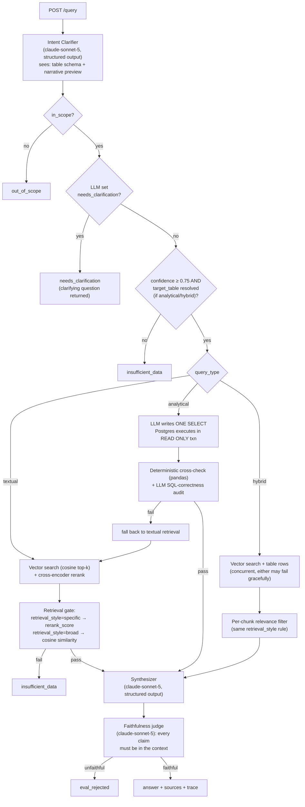
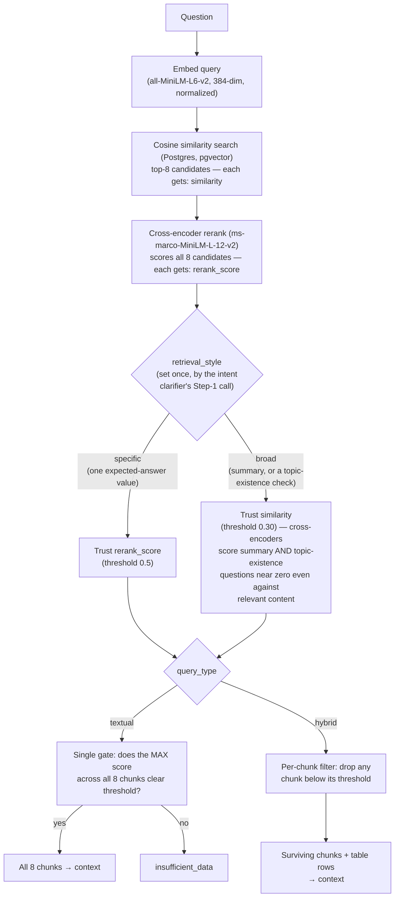

# Sqope Due Diligence QA

PDF-based question answering for financial due diligence. Indexes PDFs (text + tables) and answers textual, analytical, and hybrid questions through a single application endpoint (plus a `/health` liveness check).

> **Input format: PDF only.** The indexer accepts `.pdf` files and runs with OCR
> disabled (digital PDFs carry extractable text). Other formats and scanned
> images are out of scope.
>
> **Language: English only.** The embedding model (`all-MiniLM-L6-v2`) and the
> cross-encoder reranker are English-trained, so retrieval is calibrated for
> English-language documents and questions. Non-English content is out of scope.
>
> **No conversation memory.** Every question is answered independently — `POST
> /query` takes only `{"question": ...}`, with no session/conversation ID and
> no server-side history. A follow-up like "what about Q3?" right after asking
> about Q4 will be evaluated with zero knowledge that Q4 was ever mentioned;
> each question must be fully self-contained.

---

## Tech stack

| Layer | Choice | Why |
|---|---|---|
| API | **FastAPI** | single async `POST /query` endpoint |
| LLM orchestration | **LangChain** + **langchain-anthropic** | every LLM call uses `with_structured_output(..., method="json_schema")` — constrained decoding guarantees schema-valid output, no manual JSON parsing or retry-on-malformed-output logic needed |
| LLM | **Claude Sonnet 5** (`claude-sonnet-5`) | all 5 LLM roles: intent classification, SQL generation, answer synthesis, faithfulness judging, SQL-correctness judging |
| PDF parsing | **Docling** | structure-aware text + table extraction, digital PDFs only (OCR off) |
| Database | **PostgreSQL 16 + pgvector** | one database, two roles: `text_chunks.embedding` (vector similarity search) and `table_rows` (schema-agnostic JSONB — no fixed schema per document, columns discovered at query time) |
| Embeddings | **sentence-transformers `all-MiniLM-L6-v2`** | 384-dim, local, no external API key |
| Reranking | **cross-encoder `ms-marco-MiniLM-L-12-v2`** | reorders retrieved chunks; the LLM-set `retrieval_style` (see below) picks whether the accept/reject gate uses this score or cosine similarity |
| DB access | **SQLAlchemy (async, asyncpg)** | module-level pooled engine; API connects as a SELECT-only `api_reader` role, the indexer keeps the write role |

---

## Core agent loop

Every question passes through the same pipeline. The intent clarifier is a single structured-output LLM call that decides scope, query type, *and* which relevance signal downstream retrieval should trust (`retrieval_style`) — no separate call needed.



### Retrieval detail: cosine + rerank + `retrieval_style`

Zooming into the "Vector search + rerank" step above — cosine similarity and
reranking **always both run**, unconditionally, for every text retrieval.
`retrieval_style` never skips either step; it only decides which of the two
already-computed scores gets used for the accept/reject decision, and that
decision is applied differently by `textual` (one gate for the whole answer)
vs `hybrid` (a per-chunk filter):



`k=8` (`tools/search.py::search_text_chunks`) is a standard RAG default, not a
value tuned for any specific corpus. Worth knowing: the bundled NovaTech
sample only has 9 total indexed text chunks, so at that scale this retrieves
almost the entire document regardless of the question — the parameter only
starts to matter (and would need real tuning against recall/latency/cost)
once the corpus grows into the hundreds or thousands of chunks across
multiple documents.

**Anti-hallucination layers:**
- Scope gate — the clarifier first decides if the question is about the indexed document(s); unrelated questions are declined (`out_of_scope`) instead of answered. It sees both the table schema *and* a narrative-text preview, so a question only answerable from prose (not a fact-lookup an LLM would otherwise reject as "not in scope") is still recognized as in-scope
- Clarification — the intent clarifier can itself flag a question as ambiguous (e.g. asking about a "Q5" that isn't in the data), returning a clarifying question (`needs_clarification`) rather than guessing
- LLM never computes numbers — for analytical queries it writes a `SELECT` and **PostgreSQL** computes the result; the query is validated as a single read-only statement and run in a `READ ONLY` transaction (writes are physically rejected), and the SQL is returned for audit
- Least-privilege database access — the API connects as a SELECT-only `api_reader` role (the indexer keeps the privileged write role), so even a generated query that slipped past validation cannot mutate or exfiltrate beyond the three data tables; defense in depth alongside the per-query `READ ONLY` transaction
- Analytical figures pass two independent gates before being trusted: a deterministic pandas recompute (disagreement = hard reject) and an LLM audit of the query against the question — a `VERIFIED` figure is never presented on the strength of a single check
- Retrieval gate: the intent clarifier tags each question's `retrieval_style` — `specific` (one expected-answer value, gated on the cross-encoder's rerank score) or `broad` (a summary/overview, or a topic-existence check like "is there anything about X", gated on cosine similarity, since cross-encoders score both of those near zero even against genuinely relevant content)
- Confidence gate — a separate check after clarification (`evals/intent_eval.py`): confidence < 0.75, or an analytical/hybrid question with no resolved target table, returns `insufficient_data` instead of guessing
- `INSUFFICIENT_DATA` sentinel → clean rejection
- Faithfulness eval on every answer (Sonnet 5 judge), with a corrupted-answer regression test (`tests/test_faithfulness_eval.py`) proving the gate rejects fabricated figures, names, and outside knowledge
- Source attribution on every response

See `SIMPLIFICATIONS.md` for what's simplified vs. a production deployment.

---

## Prerequisites

- Docker & Docker Compose
- An `ANTHROPIC_API_KEY`

---

## Quick start (Docker only — nothing else to install)

Run these in order from the repo root.

```bash
# 1. Copy the NovaTech PDF into data/ (or use your own PDF anywhere on disk)
cp /path/to/data_test_novatech_q4_2024_report_1.pdf data/

# 2. Credentials in .env (ANTHROPIC_API_KEY required; API_DB_PASSWORD is the
#    SELECT-only role the API uses — set it distinct from DB_PASSWORD)
printf "ANTHROPIC_API_KEY=sk-ant-...\nDB_PASSWORD=secret\nAPI_DB_PASSWORD=readonly-secret\n" > .env
# HF_TOKEN is optional — everything works fine without it; add HF_TOKEN=hf_...
# to .env only if you want to silence a HuggingFace rate-limit warning during
# model downloads.

# 3. Start DB + API, and build the indexer image (a one-shot container, not a
#    persistent service, so it isn't started here — just built for step 5)
docker-compose up --build -d db api
docker-compose build indexer

# 4. Wait for the API to report healthy (usually <60s — model downloads happen at build time)
docker ps   # look for "healthy" next to the -api-1 container

# 5. Index a PDF — mount YOUR OWN file at /data/report.pdf (idempotent, safe to re-run)
docker run --rm \
  --network sqope-ai-home-assignment-task_default \
  -e DATABASE_URL=postgresql://sqope:secret@db:5432/sqope \
  -v "/absolute/path/to/your.pdf:/data/report.pdf" \
  sqope-ai-home-assignment-task-indexer

# 6. Ask a question (adapt this to whatever PDF you indexed — this example
#    question assumes the bundled NovaTech sample)
curl -s -X POST http://localhost:8000/query \
  -H "Content-Type: application/json" \
  -d '{"question": "What were the main Q4 highlights?"}' | jq .
```

Or use the Makefile shortcuts for the same steps:

```bash
export ANTHROPIC_API_KEY=sk-ant-...
make docker-up                       # start DB + API, build the indexer image
make docker-index PDF=/path/to.pdf   # index a PDF (defaults to the bundled sample)
make ask                             # interactive chat client in your terminal
make ask TRACE=1                     # same, but also prints each answer's pipeline steps
make docker-test                     # run integration tests in Docker
make docker-down                     # stop everything
```

To reset and start completely fresh (wipes the DB volume): `make fresh`.

---

## Talking to the assistant

Three ways, easiest first:

- **Interactive terminal client:** `make ask` — type questions, see answers and sources.
  Add `TRACE=1` to also print each answer's pipeline steps. (Runs `ask.py` in a container
  against the API.)
- **Browser (Swagger UI):** open **http://localhost:8000/docs** → `POST /query` → "Try it out".
- **curl** (examples below).

## Example queries

> These assume the bundled NovaTech sample PDF is indexed (Quick Start step 1).
> They're about that document's specific content (Q4 highlights, cloud revenue
> share, departmental headcount) — the system itself isn't NovaTech-specific in
> any way, so if you indexed a different PDF, ask about facts that are actually
> in *your* document instead of pasting these verbatim.

By default `/query` returns just the answer — add `?verbose=true` for the full
structured response (query type, sources, eval status, pipeline trace, and the
verified SQL/rows behind analytical answers). See **Response shape** below.

```bash
# Textual — broad/summary (retrieval_style="broad", gated on cosine similarity)
curl -s -X POST http://localhost:8000/query \
  -H "Content-Type: application/json" \
  -d '{"question": "What were the main Q4 highlights?"}' | jq .

# Textual — specific fact (retrieval_style="specific", gated on rerank_score)
curl -s -X POST http://localhost:8000/query \
  -H "Content-Type: application/json" \
  -d '{"question": "What percentage of total revenue came from cloud services?"}' | jq .

# Analytical — sum
curl -s -X POST http://localhost:8000/query \
  -H "Content-Type: application/json" \
  -d '{"question": "What was the total headcount across all departments in Q3?"}' | jq .

# Analytical — max
curl -s -X POST http://localhost:8000/query \
  -H "Content-Type: application/json" \
  -d '{"question": "Which department had the highest headcount in Q4?"}' | jq .

# Analytical — comparison
curl -s -X POST http://localhost:8000/query \
  -H "Content-Type: application/json" \
  -d '{"question": "How did Q3 headcount compare to Q4 across departments?"}' | jq .

# Hybrid — prediction
curl -s -X POST http://localhost:8000/query \
  -H "Content-Type: application/json" \
  -d '{"question": "Based on the headcount trends, which department is likely to need the most hiring in Q1?"}' | jq .

# Out of scope — declined, not guessed
curl -s -X POST http://localhost:8000/query \
  -H "Content-Type: application/json" \
  -d '{"question": "What was Apple'"'"'s revenue last quarter?"}' | jq .
```

**Response shape (default):**
```json
{
  "answer": "string or null",
  "reason": "set only when answer is null — why no answer was given"
}
```

**Response shape (`?verbose=true`):**
```json
{
  "answer": "string or null",
  "query_type": "textual | analytical | hybrid",
  "sources": [{"doc_filename": "...", "page_number": 5, "content_snippet": "..."}],
  "eval_passed": true,
  "answer_basis": "indexed_documents | insufficient_data | eval_rejected | out_of_scope | needs_clarification",
  "rejection_reason": "null, an explanation, or (for needs_clarification) the clarifying question",
  "confidence": 0.92,
  "trace": ["[router] ...", "[intent] ...", "[analytical] ..."],
  "result": {"kind": "analytical | hybrid", "sql": "...", "rows": [...], "computed": {...}}
}
```

---

## Running tests

```bash
# Unit tests — no Docker, no API key needed (requires local Python env)
make test

# Integration tests in Docker — requires docker-compose up + PDF indexed
make docker-test

# Integration tests locally against a running API
API_URL=http://localhost:8000 make test-integration
```

### Quantified eval suite

`evals/eval_suite.py` runs real calls (real embeddings, real reranker, real
Anthropic API) against a small labeled question set and reports actual
numbers instead of pass/fail: retrieval recall@k/MRR, intent-classification
precision/recall/F1, end-to-end answer correctness, and faithfulness
precision/recall/F2 (F2, not F1 — missing a real hallucination is worse than
over-rejecting a good answer, so recall is weighted above precision for that
gate specifically).

```bash
make eval   # requires the stack running (make docker-up) + a local Python env
```

---

## Indexing your own / additional PDFs

The indexer image contains no PDF — you mount one at `/data/report.pdf` and the
default command indexes it:

```bash
docker run --rm \
  --network sqope-ai-home-assignment-task_default \
  -e DATABASE_URL=postgresql://sqope:${DB_PASSWORD}@db:5432/sqope \
  -v /absolute/path/to/your.pdf:/data/report.pdf \
  sqope-ai-home-assignment-task-indexer
```

Or with the Makefile: `make docker-index PDF=/absolute/path/to/your.pdf`

Indexing is idempotent — re-running on the same file is a no-op (file-hash check).
Indexing a *different* PDF adds it alongside existing ones; the assistant then
answers across all indexed documents. To replace everything, reset first
(`docker-compose down -v`, or `TRUNCATE documents, text_chunks, table_rows CASCADE;`).

### Inspecting parsing on any PDF (no DB needed)

To check how a PDF's tables and text are parsed before indexing:

```bash
docker run --rm \
  -v /path/to/file.pdf:/data/report.pdf \
  sqope-ai-home-assignment-task-indexer \
  python -m indexer.cli --dry-run /data/report.pdf
```

This prints every extracted table (name, columns, sample rows) and text chunks
without writing to the database — useful for verifying parsing quality on a new
document.
